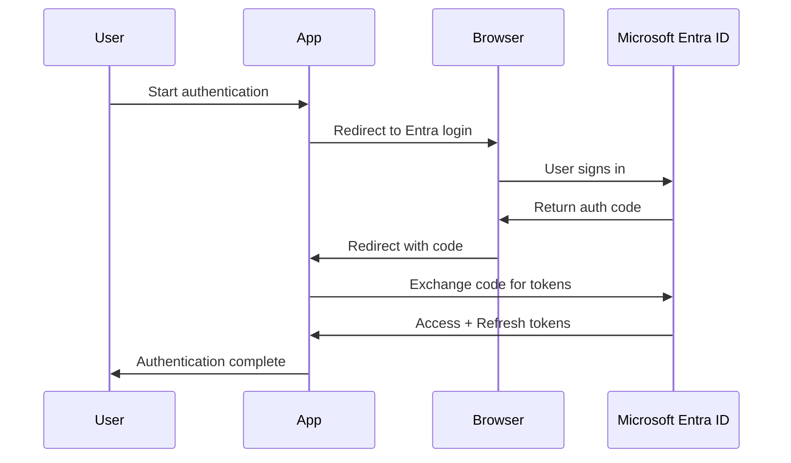

# Authorization Code Flow

The Authorization Code flow provides secure user authentication by redirecting to a web browser for sign-in, then exchanging an authorization code for tokens. This flow is used for applications that can securely store client secrets.

## Overview

**Use this flow when:**
- Your application needs user authentication
- You have a web application with a backend server
- You can securely store client secrets
- You want the most secure user authentication flow

**Key characteristics:**
- User signs in via web browser
- Application receives authorization code
- Backend exchanges code for tokens
- Supports refresh tokens for long-lived sessions

> **Note:** Entra Auth Cli currently focuses on the **Interactive Browser Flow** for user authentication in CLI scenarios. The Authorization Code flow is typically used in web applications with backend servers. For CLI tools, use [Interactive Browser Flow](/docs/oauth-flows/interactive-browser/) instead.

## How It Works



## Flow Steps

### 1. Authorization Request

Application redirects user to Microsoft Entra ID:

```
https://login.microsoftonline.com/{tenant}/oauth2/v2.0/authorize?
  client_id={client-id}&
  response_type=code&
  redirect_uri={redirect-uri}&
  scope={scopes}&
  state={state}&
  code_challenge={challenge}&
  code_challenge_method=S256
```

**Parameters:**
- `client_id` - Your application ID
- `response_type=code` - Request authorization code
- `redirect_uri` - Where to send user after login
- `scope` - Permissions being requested
- `state` - Anti-forgery token
- `code_challenge` - PKCE challenge (recommended)

### 2. User Authentication

1. User sees Microsoft sign-in page
2. User enters credentials
3. User may need MFA (if required)
4. User consents to permissions (if needed)

### 3. Authorization Code

After successful authentication, user is redirected:

```
{redirect-uri}?
  code={authorization-code}&
  state={state}
```

### 4. Token Exchange

Application exchanges code for tokens:

```bash {linenos=inline}
POST https://login.microsoftonline.com/{tenant}/oauth2/v2.0/token

client_id={client-id}
&scope={scopes}
&code={authorization-code}
&redirect_uri={redirect-uri}
&grant_type=authorization_code
&client_secret={client-secret}
&code_verifier={verifier}
```

### 5. Token Response

```json
{
  "token_type": "Bearer",
  "scope": "user.read mail.read",
  "expires_in": 3600,
  "access_token": "eyJ0eXAi...",
  "refresh_token": "AwABAAAA..."
}
```

## PKCE Extension

**Proof Key for Code Exchange (PKCE)** enhances security by preventing authorization code interception.

### Implementation

```bash {linenos=inline}
# 1. Generate code verifier (random string)
CODE_VERIFIER=$(openssl rand -base64 32 | tr -d "=+/" | cut -c1-43)

# 2. Create code challenge (SHA256 hash)
CODE_CHALLENGE=$(echo -n "$CODE_VERIFIER" | shasum -a 256 | cut -d' ' -f1 | xxd -r -p | base64 | tr -d "=+/" | cut -c1-43)

# 3. Use challenge in authorization request
# code_challenge=$CODE_CHALLENGE
# code_challenge_method=S256

# 4. Use verifier in token exchange
# code_verifier=$CODE_VERIFIER
```

## Web Application Example

### Node.js/Express

```javascript
const express = require('express');
const crypto = require('crypto');
const axios = require('axios');

const app = express();
const sessions = new Map();

const config = {
  tenantId: process.env.TENANT_ID,
  clientId: process.env.CLIENT_ID,
  clientSecret: process.env.CLIENT_SECRET,
  redirectUri: 'http://localhost:3000/callback',
  scopes: ['User.Read', 'Mail.Read']
};

// Generate PKCE challenge
function generatePKCE() {
  const verifier = crypto.randomBytes(32).toString('base64url');
  const challenge = crypto
    .createHash('sha256')
    .update(verifier)
    .digest('base64url');
  return { verifier, challenge };
}

// Start authentication
app.get('/login', (req, res) => {
  const state = crypto.randomBytes(16).toString('hex');
  const pkce = generatePKCE();
  
  sessions.set(state, { pkce });
  
  const authUrl = `https://login.microsoftonline.com/${config.tenantId}/oauth2/v2.0/authorize?` +
    `client_id=${config.clientId}&` +
    `response_type=code&` +
    `redirect_uri=${encodeURIComponent(config.redirectUri)}&` +
    `scope=${encodeURIComponent(config.scopes.join(' '))}&` +
    `state=${state}&` +
    `code_challenge=${pkce.challenge}&` +
    `code_challenge_method=S256`;
  
  res.redirect(authUrl);
});

// Handle callback
app.get('/callback', async (req, res) => {
  const { code, state } = req.query;
  const session = sessions.get(state);
  
  if (!session) {
    return res.status(400).send('Invalid state');
  }
  
  try {
    const tokenResponse = await axios.post(
      `https://login.microsoftonline.com/${config.tenantId}/oauth2/v2.0/token`,
      new URLSearchParams({
        client_id: config.clientId,
        client_secret: config.clientSecret,
        scope: config.scopes.join(' '),
        code: code,
        redirect_uri: config.redirectUri,
        grant_type: 'authorization_code',
        code_verifier: session.pkce.verifier
      })
    );
    
    const { access_token, refresh_token } = tokenResponse.data;
    
    // Store tokens securely (use proper session management)
    sessions.set(state, { access_token, refresh_token });
    
    res.send('Authentication successful!');
  } catch (error) {
    res.status(500).send('Token exchange failed');
  }
});

app.listen(3000);
```

### Python/Flask

```python
from flask import Flask, redirect, request, session
from msal import ConfidentialClientApplication
import secrets

app = Flask(__name__)
app.secret_key = secrets.token_hex(32)

config = {
    'tenant_id': 'your-tenant-id',
    'client_id': 'your-client-id',
    'client_secret': 'your-client-secret',
    'redirect_uri': 'http://localhost:5000/callback',
    'scopes': ['User.Read', 'Mail.Read']
}

msal_app = ConfidentialClientApplication(
    config['client_id'],
    authority=f"https://login.microsoftonline.com/{config['tenant_id']}",
    client_credential=config['client_secret']
)

@app.route('/login')
def login():
    auth_url = msal_app.get_authorization_request_url(
        config['scopes'],
        redirect_uri=config['redirect_uri'],
        state=secrets.token_urlsafe(16)
    )
    return redirect(auth_url)

@app.route('/callback')
def callback():
    code = request.args.get('code')
    
    result = msal_app.acquire_token_by_authorization_code(
        code,
        scopes=config['scopes'],
        redirect_uri=config['redirect_uri']
    )
    
    if 'access_token' in result:
        session['tokens'] = result
        return 'Authentication successful!'
    
    return 'Authentication failed', 400

if __name__ == '__main__':
    app.run(port=5000)
```

## Refresh Tokens

Authorization Code flow provides refresh tokens for long-lived sessions:

```bash {linenos=inline}
# Exchange refresh token for new access token
POST https://login.microsoftonline.com/{tenant}/oauth2/v2.0/token

client_id={client-id}
&scope={scopes}
&refresh_token={refresh-token}
&grant_type=refresh_token
&client_secret={client-secret}
```

### Token Refresh Strategy

```javascript
class TokenManager {
  constructor(tokens) {
    this.accessToken = tokens.access_token;
    this.refreshToken = tokens.refresh_token;
    this.expiresAt = Date.now() + (tokens.expires_in * 1000);
  }
  
  isExpired() {
    return Date.now() >= this.expiresAt - 60000; // 1 min buffer
  }
  
  async getValidToken() {
    if (!this.isExpired()) {
      return this.accessToken;
    }
    
    return await this.refreshAccessToken();
  }
  
  async refreshAccessToken() {
    const response = await fetch(tokenUrl, {
      method: 'POST',
      body: new URLSearchParams({
        client_id: config.clientId,
        client_secret: config.clientSecret,
        refresh_token: this.refreshToken,
        grant_type: 'refresh_token'
      })
    });
    
    const tokens = await response.json();
    this.accessToken = tokens.access_token;
    this.expiresAt = Date.now() + (tokens.expires_in * 1000);
    
    return this.accessToken;
  }
}
```

## Security Considerations

### State Parameter

Always validate state parameter to prevent CSRF attacks:

```javascript
// Generate unique state
const state = crypto.randomBytes(16).toString('hex');
session.state = state;

// Validate in callback
if (req.query.state !== session.state) {
  throw new Error('Invalid state parameter');
}
```

### PKCE

Always use PKCE, even with client secret:

- Prevents authorization code interception
- Required for public clients
- Recommended for all OAuth clients

### Secure Storage

Never expose tokens to client-side JavaScript:

```javascript
// ❌ Bad - token in browser
localStorage.setItem('token', access_token);

// ✅ Good - token in server session
session.tokens = { access_token, refresh_token };
```

## Comparison with Other Flows

| Feature | Authorization Code | Interactive Browser | Device Code |
|---------|-------------------|---------------------|-------------|
| **Browser Required** | Yes | Yes | No |
| **Backend Server** | Required | Optional | Optional |
| **Client Secret** | Yes | No | No |
| **Refresh Tokens** | Yes | Yes | Yes |
| **PKCE** | Recommended | Required | Required |
| **Best For** | Web apps | Desktop apps | Headless devices |

## CLI Alternative

For command-line tools, use **Interactive Browser Flow** instead:

```bash {linenos=inline}
# Interactive Browser (recommended for CLI)
entra-auth-cli get-token --flow interactive

# Opens browser, no redirect URI needed
# Tokens handled automatically by CLI
```

See [Interactive Browser Flow](/docs/oauth-flows/interactive-browser/) for CLI-friendly user authentication.

## Next Steps

- [Interactive Browser Flow](/docs/oauth-flows/interactive-browser/) - CLI-friendly user authentication
- [Device Code Flow](/docs/oauth-flows/device-code/) - Authentication without local browser
- [Security Best Practices](/docs/recipes/security-hardening/) - Secure your implementation
