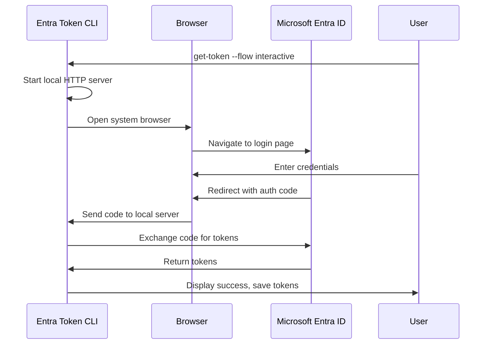

# Interactive Browser Flow

The Interactive Browser flow provides seamless user authentication by opening your system's default web browser for sign-in, then automatically returning tokens to the CLI. This is the recommended flow for desktop applications and CLI tools that need user authentication.

## Overview

**Use this flow when:**
- You need user authentication in a CLI or desktop app
- User has access to a local web browser
- You want the best user experience for interactive authentication
- Working with delegated permissions (on behalf of a user)

**Key benefits:**
- Seamless browser integration
- Supports all Entra ID features (MFA, Conditional Access)
- Automatic token handling
- No redirect URI configuration needed

## Quick Start

```bash
# Authenticate with interactive browser
entratool get-token --flow interactive

# With specific profile
entratool get-token --flow interactive --profile myapp

# With custom scopes
entratool get-token --flow interactive \
  --scope https://graph.microsoft.com/User.Read
```

## How It Works



### Flow Steps

1. **CLI starts local server** - Listens on localhost for callback
2. **Browser opens** - System default browser launches
3. **User signs in** - Microsoft Entra ID login page
4. **Callback** - Browser redirects to local server with auth code
5. **Token exchange** - CLI exchanges code for tokens
6. **Complete** - Tokens saved and displayed

## Configuration

### Profile Setup

Create a profile for interactive browser flow:

```bash
entratool create-profile --name interactive-app
```

When prompted:
- **Profile Name**: Identifier for this configuration
- **Tenant ID**: Your Microsoft Entra tenant ID
- **Client ID**: Public client application ID
- **Flow**: interactive (optional default)
- **Scopes**: Delegated permissions

### Azure App Registration

Configure app registration for interactive browser flow:

```bash
# Create public client application
az ad app create \
  --display-name "CLI Interactive App" \
  --sign-in-audience AzureADMyOrg \
  --enable-access-token-issuance true

# Get the application ID
APP_ID=$(az ad app list --display-name "CLI Interactive App" --query '[0].appId' -o tsv)

# Configure as public client
az ad app update \
  --id $APP_ID \
  --is-fallback-public-client true

# Add redirect URI for local loopback
az ad app update \
  --id $APP_ID \
  --web-redirect-uris "http://localhost"
```

**Required settings:**
- **Application type**: Public client
- **Redirect URI**: `http://localhost` (any port)
- **Platform**: Mobile and desktop applications
- **Permissions**: Delegated permissions only

## Usage Examples

### Basic Authentication

```bash
# Default profile, default scopes
entratool get-token --flow interactive

# Specific profile
entratool get-token --flow interactive --profile production

# Override scopes
entratool get-token --flow interactive \
  --scope "https://graph.microsoft.com/User.Read https://graph.microsoft.com/Mail.Read"
```

### With Microsoft Graph

```bash
# Get token for Graph API
TOKEN=$(entratool get-token --flow interactive \
  --scope https://graph.microsoft.com/User.Read \
  --output json | jq -r .access_token)

# Read user profile
curl -H "Authorization: Bearer $TOKEN" \
  https://graph.microsoft.com/v1.0/me | jq .
```

### In Scripts

```bash
#!/bin/bash
set -euo pipefail

# Function to get token with interactive flow
get_user_token() {
    local scopes="${1:-https://graph.microsoft.com/User.Read}"
    
    echo "Authenticating... Browser will open shortly." >&2
    
    if ! token_json=$(entratool get-token \
        --flow interactive \
        --scope "$scopes" \
        --output json 2>/dev/null); then
        echo "Authentication failed" >&2
        return 1
    fi
    
    echo "$token_json" | jq -r .access_token
}

# Use the token
echo "Getting your profile..."
TOKEN=$(get_user_token)

curl -s -H "Authorization: Bearer $TOKEN" \
  https://graph.microsoft.com/v1.0/me \
  | jq '{name: .displayName, email: .mail, jobTitle: .jobTitle}'
```

### Silent Authentication

After initial sign-in, tokens are cached:

```bash
# First run - browser opens
entratool get-token --flow interactive --profile myapp

# Subsequent runs - uses cached token (no browser)
entratool get-token --profile myapp

# Token automatically refreshed when expired
```

## User Experience

### First-Time Authentication

```
$ entratool get-token --flow interactive

Opening browser for authentication...
✓ Browser opened
⏳ Waiting for sign-in...

[Browser opens to Microsoft login page]

✓ Authentication successful!
Token expires: 2025-12-28 15:30:00
Token saved to profile 'default'
```

### Cached Token (Subsequent Runs)

```
$ entratool get-token

✓ Using cached token
Token expires: 2025-12-28 15:30:00
```

### Token Refresh (Auto)

```
$ entratool get-token

⟳ Refreshing expired token...
✓ Token refreshed
Token expires: 2025-12-28 16:30:00
```

## Browser Behavior

### System Default Browser

The CLI automatically detects and opens your system's default browser:

```bash
# macOS - opens Safari/Chrome/Firefox (whatever is default)
open https://login.microsoftonline.com/...

# Windows - opens Edge/Chrome/Firefox
start https://login.microsoftonline.com/...

# Linux - opens default browser
xdg-open https://login.microsoftonline.com/...
```

### Custom Browser

Set environment variable to use specific browser:

```bash
# Use Chrome
BROWSER=google-chrome entratool get-token --flow interactive

# Use Firefox
BROWSER=firefox entratool get-token --flow interactive

# Use specific browser path
BROWSER="/Applications/Firefox.app/Contents/MacOS/firefox" \
  entratool get-token --flow interactive
```

### Headless Environments

If browser cannot open (e.g., SSH session without X11):

```bash
# CLI detects no display and falls back to device code
entratool get-token --flow interactive

Output:
No display detected. Falling back to device code flow.
To sign in, use a web browser to open:
  https://microsoft.com/devicelogin
And enter code: ABCD-EFGH
```

## Local Server Port

The CLI starts a temporary HTTP server for the OAuth callback:

```bash
# Random available port (default)
entratool get-token --flow interactive

# Specific port
entratool get-token --flow interactive --port 8080

# Port range
entratool get-token --flow interactive --port-range 8000-8100
```

**Port selection:**
- Default: Random available port between 49152-65535
- Automatically finds available port
- Server stops after receiving callback
- No persistent server process

## Security Features

### PKCE (Proof Key for Code Exchange)

Always enabled for maximum security:

```
1. CLI generates random code verifier
2. Creates SHA256 hash (code challenge)
3. Sends challenge in auth request
4. Sends verifier in token exchange
5. Entra ID validates match
```

### State Parameter

Prevents CSRF attacks:

```
1. CLI generates random state token
2. Includes in authorization request
3. Validates match in callback
4. Rejects mismatched state
```

### HTTPS Enforcement

- Authorization requests use HTTPS
- Token exchanges use HTTPS
- Only callback uses HTTP localhost (secure by design)

### Token Storage

Tokens stored securely per platform:

- **Windows**: DPAPI encrypted storage
- **macOS**: Keychain
- **Linux**: Encrypted file with user-only permissions

## Advanced Features

### Multiple Accounts

Switch between user accounts:

```bash
# Create profiles for different users
entratool create-profile --name work
entratool create-profile --name personal

# Authenticate with work account
entratool get-token --flow interactive --profile work

# Authenticate with personal account
entratool get-token --flow interactive --profile personal

# Switch accounts
entratool get-token --profile work
entratool get-token --profile personal
```

### Conditional Access

Supports all Conditional Access policies:

- **MFA**: Automatically prompts for additional verification
- **Device Compliance**: Works with compliant device policies
- **Location-Based**: Respects IP/location restrictions
- **Terms of Use**: Shows ToU prompts when required

### Session Persistence

```bash
# Check token expiry
entratool inspect --profile myapp

# Force refresh
entratool refresh --profile myapp

# Clear cached token
entratool clear-cache --profile myapp

# Re-authenticate
entratool get-token --flow interactive --profile myapp
```

## Troubleshooting

### Browser Doesn't Open

**Problem:** Browser fails to open automatically

**Solutions:**

```bash
# 1. Check default browser setting
# macOS
defaults read com.apple.LaunchServices/com.apple.launchservices.secure | grep -A 2 browser

# 2. Manually copy URL
entratool get-token --flow interactive --show-url

# 3. Use specific browser
BROWSER=firefox entratool get-token --flow interactive

# 4. Fall back to device code
entratool get-token --flow device-code
```

### Port Already in Use

**Problem:** "Port 8080 is already in use"

**Solutions:**

```bash
# Use different port
entratool get-token --flow interactive --port 8081

# Use random available port (default)
entratool get-token --flow interactive

# Check what's using the port
lsof -i :8080
```

### Timeout Waiting for Callback

**Problem:** "Timeout waiting for authentication callback"

**Solutions:**

```bash
# 1. Verify redirect URI in Azure Portal
# Must include: http://localhost

# 2. Check firewall isn't blocking localhost
# Temporarily disable firewall for testing

# 3. Try specific port
entratool get-token --flow interactive --port 8080

# 4. Check browser console for errors
# Look for CORS or redirect issues
```

### Cached Token Won't Refresh

**Problem:** Getting old/expired token

**Solutions:**

```bash
# Clear token cache
entratool clear-cache --profile myapp

# Force re-authentication
entratool get-token --flow interactive --profile myapp --force

# Delete and recreate profile
entratool delete-profile --name myapp
entratool create-profile --name myapp
```

## Platform-Specific Notes

### macOS

```bash
# Default browser (Safari/Chrome/Firefox)
entratool get-token --flow interactive

# Token storage: macOS Keychain
# View tokens:
security find-generic-password -s "entratool-cli"
```

### Windows

```bash
# Default browser (Edge/Chrome/Firefox)
entratool.exe get-token --flow interactive

# Token storage: DPAPI
# Encrypted per-user, per-machine
```

### Linux

```bash
# Default browser (Firefox/Chrome/Chromium)
entratool get-token --flow interactive

# Token storage: Encrypted file
# Location: ~/.entratool/tokens.enc
# Permissions: 600 (user-only)

# Headless systems
export DISPLAY=:0  # If X11 available
entratool get-token --flow interactive
```

## Best Practices

### Profile Organization

```bash
# Separate profiles by purpose
entratool create-profile --name graph-reader
entratool create-profile --name azure-admin
entratool create-profile --name mail-sender

# Use descriptive names
entratool create-profile --name "production-api"
entratool create-profile --name "dev-testing"
```

### Scope Management

```bash
# Minimum required scopes
entratool get-token --flow interactive \
  --scope "https://graph.microsoft.com/User.Read"

# Multiple scopes
entratool get-token --flow interactive \
  --scope "User.Read Mail.Read Calendars.Read"

# Avoid .default with interactive flow
# Be specific about delegated permissions needed
```

### Error Handling

```bash
get_token_safe() {
    local profile="${1:-default}"
    local max_retries=2
    local attempt=0
    
    while [ $attempt -lt $max_retries ]; do
        if token=$(entratool get-token \
            --flow interactive \
            --profile "$profile" \
            --output json 2>/dev/null); then
            echo "$token" | jq -r .access_token
            return 0
        fi
        
        attempt=$((attempt + 1))
        if [ $attempt -lt $max_retries ]; then
            echo "Retrying authentication..." >&2
            sleep 2
        fi
    done
    
    echo "Authentication failed after $max_retries attempts" >&2
    return 1
}
```

## Comparison with Other Flows

| Feature | Interactive Browser | Device Code | Client Credentials |
|---------|-------------------|-------------|-------------------|
| **User Interaction** | Browser on same device | Browser on any device | None |
| **Browser Required** | Yes, local | Yes, separate device | No |
| **Auth Type** | Delegated | Delegated | Application |
| **MFA Support** | Full | Full | N/A |
| **Conditional Access** | Full | Full | Limited |
| **Best For** | Desktop apps, CLI | Headless devices | Services, automation |
| **User Experience** | Seamless | Extra steps | N/A |
| **Refresh Tokens** | Yes | Yes | No (always valid) |

## Next Steps

- [Device Code Flow](/docs/oauth-flows/device-code/) - Alternative for headless devices
- [Client Credentials Flow](/docs/oauth-flows/client-credentials/) - Service authentication
- [Managing Profiles](/docs/user-guide/managing-profiles/) - Profile management guide
- [Troubleshooting](/docs/troubleshooting/authentication/) - Common authentication issues
